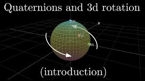

# Quaternion Visualizer
> Task Seleksi Lab IRK created by Ariel Herfrison

versi **17 Juli 2025**

## 💡 Latar Belakang

Dalam Aljabar Linear dan Geometri, kalian telah belajar tentang Aljabar Quaternion. Quaternion memberikan cara intuitif sekaligus ingenious dalam mengkalkulasi bilangan 3 dimensi, salah satunya adalah kalkulasi rotasi. Quaternion antara lain diaplikasikan dalam 3D computer graphics, computer vision, robotics, magnetic resonance imaging, dan crystallographic texture analysis. Tugas Anda adalah membuat program yang dapat secara intuitif memvisualisasikan rotasi objek menggunakan quaternion. 

 

## 📝 Spesifikasi Tugas

Tugas Anda adalah membuat program yang dapat memvisualisasikan rotasi menggunakan quaternion. Kalkulasi rotasi harus dilakukan secara manual, namun visualisasi menuju layar diperbolehkan menggunakan library/module eksternal.

Berikut merupakan spesifikasinya:

### Spesifikasi Wajib (1000 Poin)

Quaternion Visualizer dibuat berbasis <b>Desktop Graphical User Interface (GUI)</b>. Bahasa dan Framework dibebaskan dan visualisasi Objek 3D diperbolehkan menggunakan library/module ekternal, namun <b>kalkulasi rotasi Quaternion wajib dibuat sendiri</b>. Quaternion Visualizer harus mengandung beberapa fitur utama di bawah ini:

1. Input Objek 3D (cube, teapot, etc) dari file berformat <b>.obj</b>.
2. Input <b>Axis of Rotation</b> dalam bentuk Unit Quaternion.
3. Input <b>Angle of Rotation</b> (derajat rotasi).
4. Aplikasi dapat menerapkan kalkulasi rotasi menggunakan <b>Quaternion</b> dari titik/point awal untuk mendapatkan titik/point setelah rotasi.
5. Aplikasi dapat menampilkan <b>visualisasi</b> Objek 3D <b>sebelum</b> rotasi.
6. Aplikasi dapat menampilkan <b>visualisasi</b> Objek 3D <b>setelah</b> rotasi.
7. Aplikasi dapat menampilkan <b>visualisasi</b> Axis of Rotation (Vector Unit) dalam bentuk garis.
8. Aplikasi dapat menampilkan <b>visualisasi</b> Coordinate Axes (xyz / ijk) beserta labelnya.
9. Aplikasi dapat menampilkan <b>visualisasi</b> Angle of Rotation dalam bentuk label di sekitar Axis of Rotation.
10. Visualisasi harus berwarna dan berlabel dengan lengkap supaya dapat membedakan antara semua visual yang ada.
11. Buatlah readme pada masing-masing repository yang menjelaskan:
    - Deskripsi Program & Fitur Program
    - Teknologi dan Framework
    - Penjelasan Quaternion dan Kegunaannya
    - Screenshot Hasil Percobaan
    - Cara menjalankan program
    - Referensi 

### Spesifikasi Bonus (2100 Poin)

1. Implementasikan <b>2 (dua)</b> metode rotasi lain selain Quaternion (e.g. Euler Angle, Tait–Bryan angles). Aplikasi harus dilengkapi dengan fitur input metode yang digunakan, beserta input tambahan lainnya (e.g. Axis of Rotation dan Angle of rotation sesuai dengan metode yang digunakan). Visualisasi tetap harus <b>lengkap</b>, mencakup tetapi tidak terbatasi Axis of Rotation dan Angle of Rotation (menyesuaikan dengan metode yang digunakan). 
2. Implementasikan <b>Graphics Engine</b> sendiri yang dapat *menggambarkan* Objek 3D dan visualisasi lainnya (Axis of Rotation, etc) dalam layar 2D, secara manual tanpa bantuan library/module eksternal. Library/module eksternal (e.g. pygame) boleh digunakan sebatas menampilkan grafik pada layar, i.e. sebagai *2D canvas* yang dapat menggambarkan titik dan garis. Graphics Engine wajib memiliki <b>Camera Control</b> yang memungkinkan pengguna untuk merubah perspektif layar.

## 📂 Pengerjaan dan Pengumpulan
1. Buatlah repositori **private** pada github masing-masing dan invite `Ariel-HS` dalam repositori tersebut.
2. Berkas yang dikumpulkan berupa **link rilis tag ke repositori github** yang telah dibuat dengan ketentuan sebagai berikut.
    - Memberikan tag `vn` pada commit terakhir Anda setiap kali ingin melakukan submisi dengan `n` adalah jumlah submisi yang telah dilakukan. (contoh: `v1` untuk submisi pertama).
    - **Tidak menggunakan *url shortener*** (bit.ly, shortlink, atau yang lain) saat melakukan pengumpulan *task*.
    - Anda dapat melakukan rilis dengan panduan [berikut](https://docs.github.com/en/repositories/releasing-projects-on-github/managing-releases-in-a-repository).
3. **Lakukan submisi** pada website seleksi IRK dengan menggunakan akun std.stei.itb.ac.id, **lakukan konfirmasi** ke LINE `arielherfrison`. Lakukan hal yang sama jika membuat rilis yang baru.
4. Jika terdapat pertanyaan dapat menghubungi LINE `arielherfrison`.

## 📌 Penilaian

| Fitur Wajib | Skor Maksimum |
| ----------- | ----------- |
| GUI/Visualisasi | 700 |
| Algoritma | 300 |
| Total Maksimum  | 1000 |

| Fitur Bonus | Skor Maksimum |
| ----------- | ----------- |
| Algoritma Unik | 600 |
| Graphics Engine | 1500 |
| Total Maksimum  | 2100 |

**Total Skor Maksimum : 3100**

**Good Luck!**
